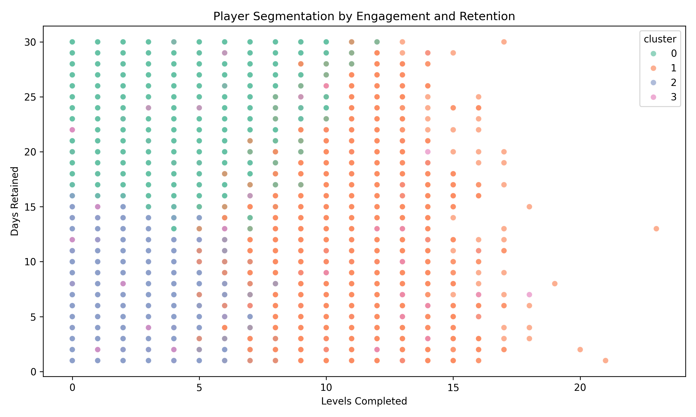

Game Report

---

## Early Player Journey Funnel

| Stage | Players | Conversion % |
|--------|----------|--------------|
| Install | 10,000 | 100% |
| Tutorial Started | 8,979 | 89.8% |
| Tutorial Completed | 6,315 | 63.1% |
| First Match | 4,124 | 41.2% |
| City Build | 2,219 | 22.2% |
| Day 1 Retained | 3,489 | 34.9% |
| Day 7 Retained | 1,724 | 17.2% |
| Day 30 Retained | 943 | 9.4% |

### Retention Benchmark Comparison

**Observation:**
- Day-1 retention (35%) exceeds genre average.
- Day-7 retention (17%) aligns perfectly with expected range (10–20%).
- Day-30 retention (9%) slightly above average, indicating a loyal player base.
**Interpretation:**
- High tutorial engagement but significant drop (~26%) mid-way.
- Only 1 in 5 players reach the story-driven core gameplay.
- Retention curve consistent with mobile casual/sim norms (D7: 15–20%, D30: 7–10%).

**Recommendations:**
- Simplify tutorial and introduce early “build reward” milestones.
- Add push notifications or reward streaks to improve D7 retention.
- Strengthen story hook between tutorial and first city mission.

---

## Player Segmentation

| Cluster | Archetype | Behavior Summary | Strategy |
|----------|------------|------------------|-----------|
| **0** | Story Explorers | High retention, low spend | Expand story content, offer narrative events |
| **1** | Engaged Builders | High progression, moderate retention | Add competitive leaderboards, timed build events |
| **2** | Casual Players | Low engagement, quick churn | Improve tutorial flow and first-session UX |
| **3** | Spenders / Whales | High spend, steady play | Create personalized bundles, loyalty rewards |

**Insights:**
- *Story Explorers* show the strongest long-term engagement.
- *Casual Players* are the largest churn source; better onboarding can lift overall retention.
- *Spenders* represent a small but high-value group worth personalized offers.

---

## Strategic Recommendations

### Retention & Engagement
- Add **first-city goal progression** and story achievements to deepen engagement.
- Implement **daily challenges** tied to story arcs or rewards.
- Use soft currency rewards or streak bonuses to reinforce daily play habits.

### Monetization
- Introduce **early-value bundles** for Engaged Builders and Spenders.
- Offer premium *story unlocks* or *VIP bonuses* for long-term players.
- Experiment with **dynamic pricing** or **A/B testing** of offers.

### Product Optimization
- Track real player-level events (tutorial_start, level_complete, purchase).
- Build analytics dashboards for player journey metrics.
- Validate simulation insights with Firebase cohort retention data.

---

## Next Steps
1. Integrate deeper event tracking into Firebase (tutorial progress, first build).
2. Conduct A/B tests for tutorial flow adjustments.
3. Measure post-update funnel and retention lift.
4. Expand segmentation model with real purchase and session data.

---

## Personal suggestions
1. The initial story had no sound.  
2. The building process should be ongoing in the background while the games and strategy should be the focus of the player
3. The use of adds for keys is overwhelming. Either give more keys for watching adds or introduce it later in the game after the player is hooked.
4. There seems to be missing opportunities for story depth and more involved strategy.  By making each person introduced into the story a new type of gameplay you increase the strategy involved.  For the electrician there could be a flow type of game. For the mason, there could be a balance the bricks type of game with emphasis on speed.  For the carpenter a haptic type of game where you nail or plaster the walls and such. Solar, cleaning the water supply.  All of these increase the depth of the game. 
5.  Lastly is a western view of the game. I would love to see the future of the country if we are talking about a comeup story.  Ideally build the future almost like a tycoon version of the game. Dare to dream and thanks for this opportunity. 
---

## Deliverables
| File | Description |
|------|--------------|
| `01_data_cleaning.ipynb` | Firebase data extraction & cleaning |
| `02_data_simulation.ipynb` | Monte Carlo simulation & analysis |
| `data/processed/` | Cleaned Firebase CSVs |
| `data/simulated/simulated_players.csv` | Simulated dataset |
| `images/early_player_funnel.png` | Funnel visualization |
| `images/player_segmentation.png` | Segmentation visualization |
| `Safari_City_Report.md / .pdf` | Final project report |

---

##  Author
**Data Analyst:** Anthony Chestnut  
**Date:** October 2025  
**Tools:** Python, Jupyter, Scikit-learn, Seaborn, Plotly  
**Focus:** Player Behavior Analytics, Retention Modeling, Game Data Science
